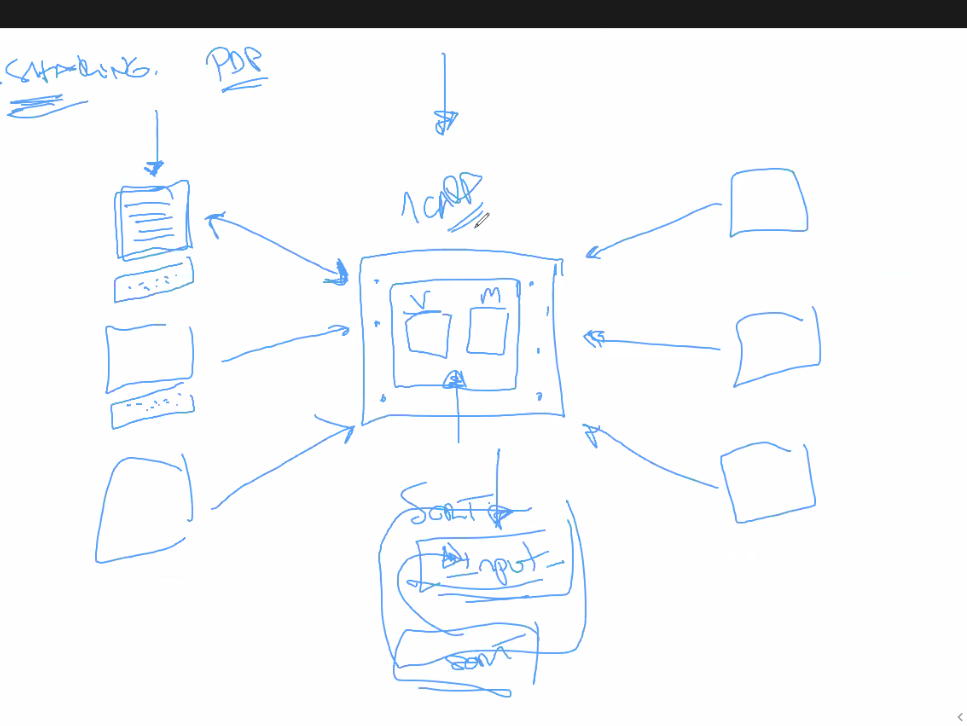
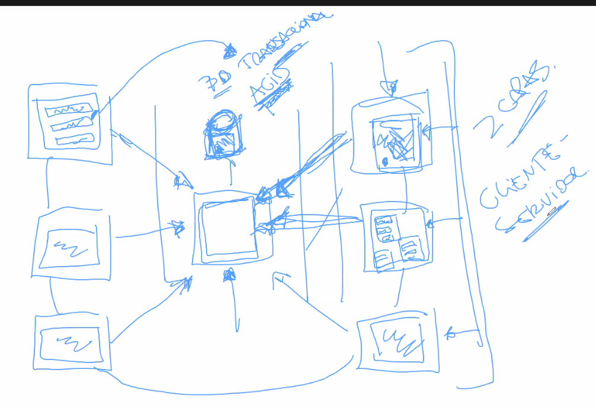
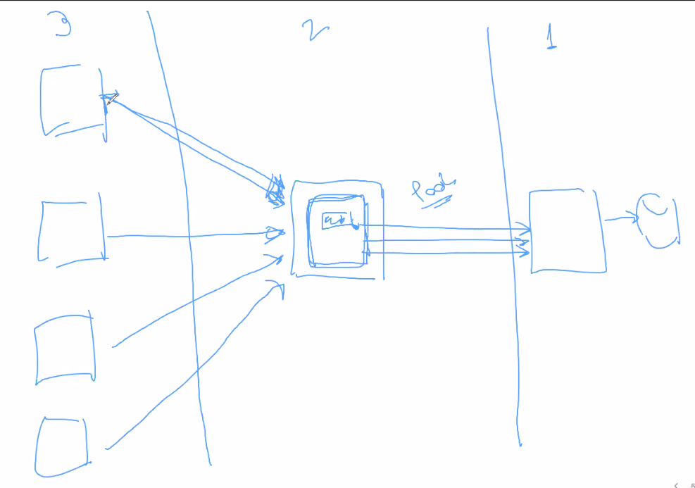
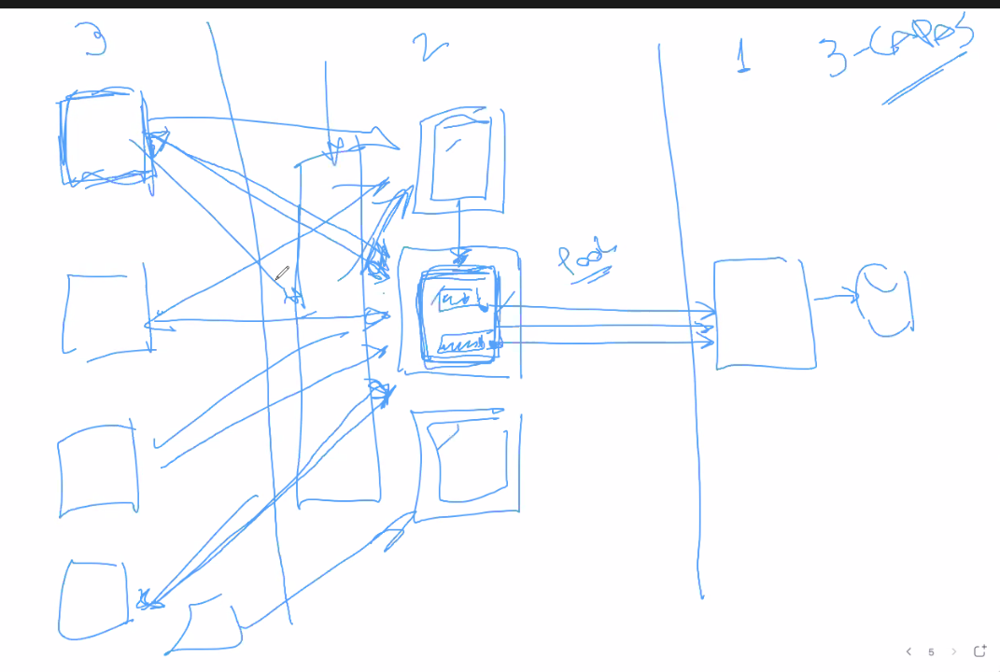
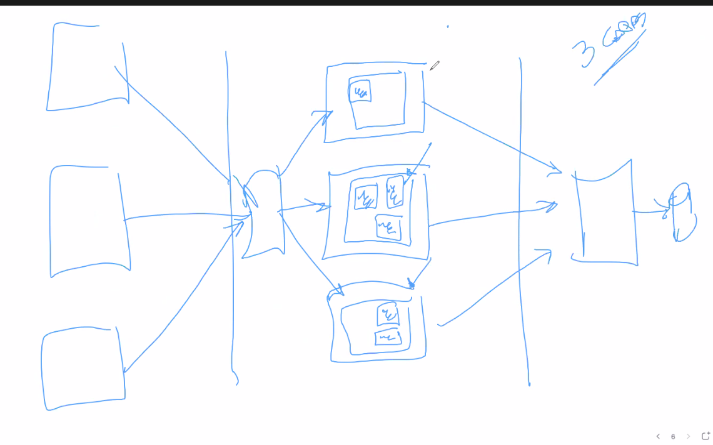
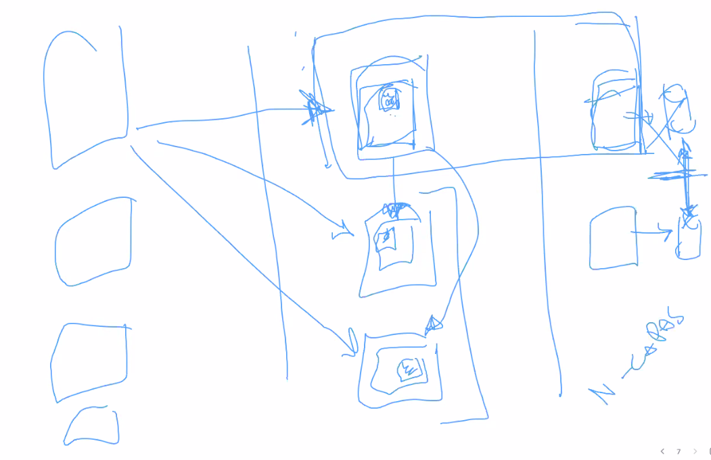
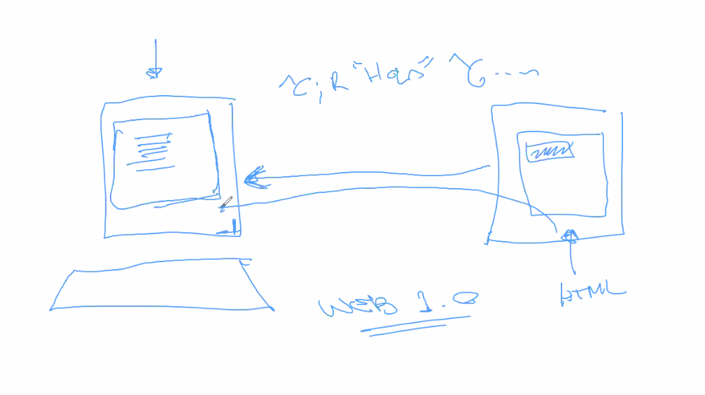
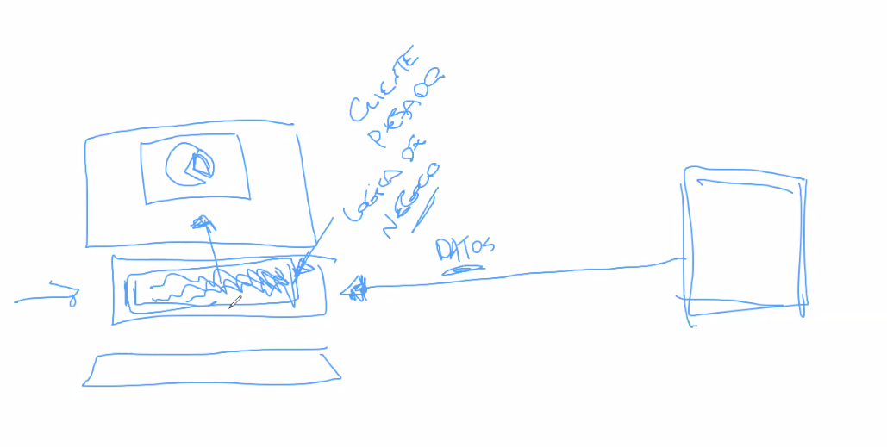
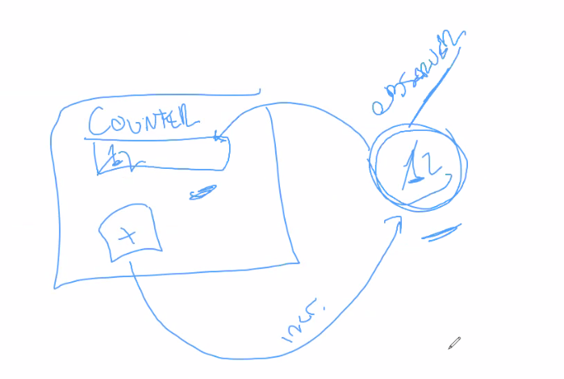

# Clase práctica 20 - fin it3 y comienzo it4 tuslibros

## It3

Al listPurchasesOf de la solución le falta un total de las ventas.

Cambios

- Cart session con expiración del lado de adentro
- Agregar el total al list purchases.
- Cambiar lo del monto total del carrito.

## Arquitectura de software

No tiene que ver con planos, o lo que hace un arquitecto, o los procesos que
sigue, ni el producto que termina generando, etc. Se usa por una cuestión
histórica.

Componentes, partes de un sistema que tienen diferentes responsabilidades. La
vamos a separar en

- Arquitectura lógica: Como particiono el sistemas en subcomponentes. Por ej. en
  subsistemas.

  > ejemplo, sistema financiero tiene subsistema de productos, clientes,
  > proveedores, bonos, etc. Cada uno serán distintas partes de mi sistema
  > genérico que tiene sus responsabilidades.

  Sin una buena arch logica, no podes tener una buena arch fisica, que escale,
  distribuida, etc. Con una buena logica la fisica es muy simple

- Arquitectura fisica: los cacharros.

Microservicios: dividir en distintos servicios lo que hace un sistema. Antes era
monolítico. Generalmente era que algo físicamente no lo podés romper, entonces
no lo podes separar en servidores o procesos, y solo lo podés escalar haciendo
copias del monolito en otros procesos o servidores.

Eso sucede porque su arquitectura lógica es un único componente, no hay
separación a nivel de subsistemas. Desde un subsistema no puedo hablar con otro
si no paso por la interfaz o fachada (como con tus libros).

Arquitectura:

- diseño de mi sistema a alto nivel
- sus partes

### Evolución

- Separación de negocio vs como lo tengo que mostrar como dos componentes
  distintas. Una cosa es el modelo y otra la vista.

  

- Si no trabajas solo y trabajas en grupo, hay varias computadoras que necesitan
  mantener la misma información. Como lo resuelvo? Lo que se termina haciendo es
  tener sistemas distribuidos en dtas computadoras, que todos se conectan con un
  servidor de base de datos relacional para persistencia.

  Separación entre modelo, presentación y persistencia.

  Una BD relacional es ACID. Recursos compartidos: como lo mantengo consistente?
  Es dificil de explicar fisicamente, porque los objetos no se comparten en el
  mismo instante de tiempo.
  
  > Para resolverlo, tenés una hoja física y 5 hojas virtuales. Las hojas
  virtuales avisan que terminan, y hay que asegurar que no terminen.'

  Esto es que los recursos sean transaccionales. Cada vez que un sistema hace
  algo, lo hace en una transacción, y le avisa al recurso compartido que
  termino, y el se asegura que no entre en conflicto con lo que algún otro
  sistema tocó. Y generalmente se busca que sean ACID

  - Atomic: transacciones atomicas
  - Consistente
  - Isolated
  - Durable

  

  Como distribuyo el sistema?

  - A la noche
  - Hago que se saque de un disco compartido

  Había sistemas que se encargaban de la dist de software en grandes empresas.

  Cliente-servidor. No escala, hay un limite.

  Oracle db2, mysql, postgres, y el servidor en el que lo estás ejecutando.

- 3 capas. Para resolver se pasa a una arch 3 capas
  - capa de persistencia
  - Servidor de aplicaciones: tiene un pool de conexiones, y va multiplexando
    los pedidos de cada cliente.
  - Clientes: ya no se conectan directamente con la DB

  

  Dependiendo de la arch lógica, puedo replicar los servidores del medio, si es
  monolítica por ej. Después veo como hago para multiplexar los servidores en
  los clientes.

  

  O la forma de escalar puede ser algo más interesante, como escalar solo
  diferentes subsistemas.

  

- Algo mas avanzado es tener distintos servidores y más de una base relacional.
  Lo cual sería una arquitectura de microservicios. La diferencia es que en el
  microservicio no se comparte la base de datos relacional.

  

  Desde el punto de vista de lógica de negocio, lo importante es que yo pueda
  particionar mi sistema lógicamente.

  Y ahí tenés n capas, cada microservicio es una capa en si misma.

Los clientes eran "bobos", que no tienen poder de procesamiento. Solo muestran
el contenido de lo que le manda el server.

### Web

- web 1.0: un cliente bobo un poco más avanzado. Es una arquitectura con un
  cliente bobo, el servidor le mandaba html

  

  Después le metieron el css y nos complicaron la vida. Es lindo como queda pero
  es complicado de usar. Lo malo es uqe la interacción es muy lenta, para cargar
  un campo nombre vos ponés tu nombre vacio, la validación se hacía en el
  servidor.

  La interacción es más difícil.

Cuando aparece la PC, ya tengo el nivel de procesamiento suficiente para que
desde el server me puedan mandar solo info, y que el cliente decida como la
presenta.

Pasa a ser un cliente *pesado*, empieza a tener lógica de negocio del lado del
cliente. La info que se envía entre el server y el cliente es todo datos, todo
lo que tiene que ver con como mostrarlo es código que está en mi computadora.

En esta arch 2 capas, el problema es como distribuyo el código del cliente 

- web 2.0

  

  El browser deja de ser una terminal boba. En 1.0 solo renderizaba HTMl. En 2.0
  el browser ejecuta javascript.

  Lo que antes era un problema, que es como distribuyo el código que renderiza
  los datos, ahora deja de ser un problema porque te envío los datos + el
  código.
  
  En la actualidad se está todo el tiempo distribuyendo código usando la red.

  Lo que empieza a pasar debido a que yo quiero mas interacción en el cliente es
  que tengo un cliente pesado, que además se tiene que encargar de la
  presentación. Acá empiezan a aparecer react, vue.js, o cosas mas simples como
  jquery, angular, etc. que empiezan a permitir tener más lógica de negocio en
  el cliente.

  Genera quilombos a nivel desarrollo. Valido que el nombre no puede estar
  vacío. Tenes que validar dos veces las cosas, también del lado del cliente.

  También usan *single page application* como gmail, siempre tenés una única
  página y solo se modifica el DOM de la página a través de la info que tenés
  del servidor.

  Y ahora también se le agregó *reactive* que está de moda (pasando). Que
  significa básicamente usar observer para que se modifique automáticamente el
  DOM.

  

  > Problema: los fwks que recién salen son inmaduros, necesitan mejorar. Vue
  > 1.0, 3.0 es muy diferente, tenías que cambiar de versión, etc.

- web 3.0

  La dif es que sea mas reactivo. Hay mucho humo. Ni maxi termina de entender la
  novedad.

El problema es que esto es un modelo poco pensado, salió todo andando, se hace
todo sobre la marcha. Poder hacer apps web 2.0 single page solo fue factible a
partir de la v8 de la VM de JS.

Antes JS se arrastraba en el browser

### MVC

Lo importante es que a nivel lógico tenemos que separar lo que es **modelo** de
lo que es **vista** o presentación. Es lo que tiene que ver con MV

Y la parte de controller no tiene sentido de pensarlo en el caso de tus libros,
pero en definitiva es fundamental mantener la separación.

Y también entre subsistemas dentro de un mismo sistema. Tenés el subsistema de
TusLibros con ventas y eso de cosas online, y por el otro lado tenes el de
proveedores, que es donde manejo cuestiones relacionadas con los providers que
me dan productos para imprimir los libros y eso.

Mi sistema es una composición de subsistemas.

Con esta separación lógica puedo poner las cosas en servidores diferentes, o lo
que quiera físicamente. La parte de presentación la puedo mandar al cliente.
Cuando tengo todo mezclado, ya no puedo mandar una parte a un lado y otra a
otro.

**Siempre** tenemos que arrancar a nivel arquitectura por la arch lógica. Una
vez que tengo eso bien resuelto, la física puede ser cualquiera. Si mi arch
lógica es mala, perdí a nivel físico.

## It4

Muchos objetivos

- Hacer las cosas más visibles.
- Construir un cliente y que use un servidor
- Al hacerlo sea visible concretamente. Trabajar con una arch client server.

El salto de tecnología lo tenemos que hacer nosotros. Tiene sentido realizar
esto mismo en otra tecnología, por ej. en otro cuatri se hizo en react (con más
tiempo).

El cliente no va a ser bobo, tiene validaciones, similar a web 2.0. Pero no va a
ser web, es nativo smalltalk. Pero con comunicación rest.

Fechas: hay mucho tiempo

- hoy (11/11): cara externa, interfaz REST.
- lunes: construccion del cliente remoto
- jueves
- consultas para parcial cuando? Tal vez algo de persistencia

Consideraciones

- Agregar catálogo al facade
- Tener un textbox para decir cuantos libros querés agregar.
- Hay que poder eliminar de carritos
- La navegación la decidimos nosotros
- Un usuario tiene que poder ver sus compras, que también necesita loguearse.
- No todo TDD. No para nada de la parte gráfico, probar que los botones
  funcionan y eso. Solo cuando agreguemos funcionalidades nuevas.

- El ejercicio anterior hablaba de un formato de devolución de los datos, que
  acá podemos no seguirlo. Podemos devolver un JSON.

- Se va a evaluar la separación de vista con modelo.

Para el lunes: tener la interfaz rest. Con los 5 que dice la consigna está bien.
Pero seguro vamos a necesitar más.

Si nos queda algo dando vueltas, podemos buscarlo con el allInstances y tirarle
`destroy`.

### Checkpoint

Dudas generales

- Para el lunes la idea es construir la cara externa de la interfaz. (hasta
  ahora hicimos la cara interna)

- El string genious se comporta igual que la cara interna. El negocio en ese
  modelo está ahi, la clase string es el modelo.

- Usar TDD solo cuando modifiquemos el modelo, cuando agreguemos func nueva.