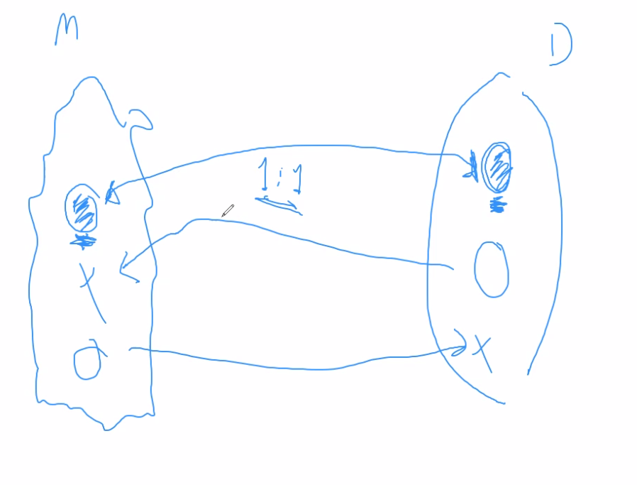

# Introducción

- Entender qué es el paradigmas de objetos
  - Hay tantas definiciones como lenguajes orientados a objetos

SOLID Principles no son principios, no aplican siempre

Las soluciones tienen que ser analizadas de manera contextual.

Smalltalk

- No está regido por presiones del mercado
- Los lenguajes de programación son un producto del mercado. Muchas competencias
  entre lenguajes de programación tienen que ver con cual tiene más cosas (no
  necesariamente cuál es mejor)

- Implementa el paradigma de objetos de la forma en la que se enseña.

Lenguajes que sirven aprender para abrir la cabeza, según Hernán:

- SML
- LISP
- Smalltalk
- Forth

## Qué es el software?

Es una representacion del conocimiento de un problema que tenemos mediante un
modelo computable de un dominio de problema de la realidad.

> **Modelo Computable** de un **Dominio de Problema** de la **Realidad**

El dominio está definido por el ser humano

- ambiguo
- con errores
- lenguaje natural

No es una def perfecta. Pocas veces se trabaja sobre dominios formales.

> Lo que no ejecuta no se mantiene, regla de oro

### Modelo

Buen modelo

- Eje funcional: Que tan buena es la representacion del dominio.

  Para que funcionalmente sea completo, cada observación del dominio se debe
  corresponder con un modelado. No necesariamente uno tiene que modelar todo, no
  hace falta que sea completo.

  > Por ejemplo la velocidad de la luz que es constante sin importar el punto de
  > referencia. El modelado newtoniano siempre la velocidad depende del punto de
  > referencia en el que se vé.

  Cada representación que tengo en mi modelo tiene que existir porque hay algo
  en el dominio del problema que está representando.

  > Yo no puedo tener en la fisica una velocidad que sea litros/metros^2, no es
  > velocidad. Si repr. de esa manera creo un modelo que no representa nada de
  > la realidad.

  Para hacer un buen modelo, lo que tenemos que tener es una relacion 1 a 1
  (isomorfismo) entre lo que yo observo y lo que represento. Si no cumplo con
  esto, desde el punto de vista de modelado mi modelo no es bueno

  

- Eje descriptivo: Que tan entendible es el modelo. Que tan bien transmite lo
  que yo pienso al resto del equipo de trabajo.

  Es la parte *artística* de nuestra profesión

- Eje implementativo: Como ejecuta en el ambiente técnico. Es algo de
  eficiencia, esto no lo vamos a ver y para esto están las materias de
  algoritmos.

Tenemos que hacer software que se banque el crecimiento constante del dominio
del problema.