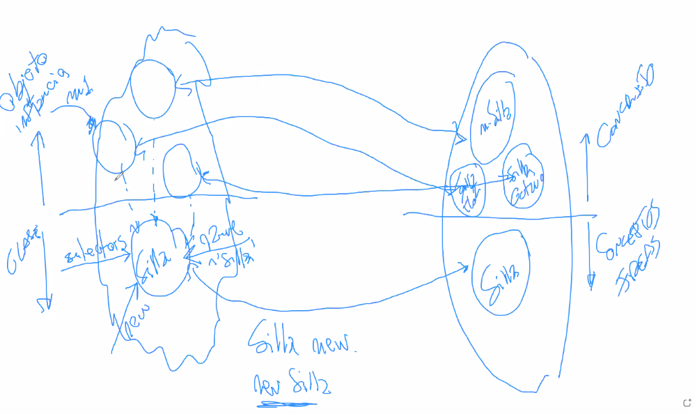
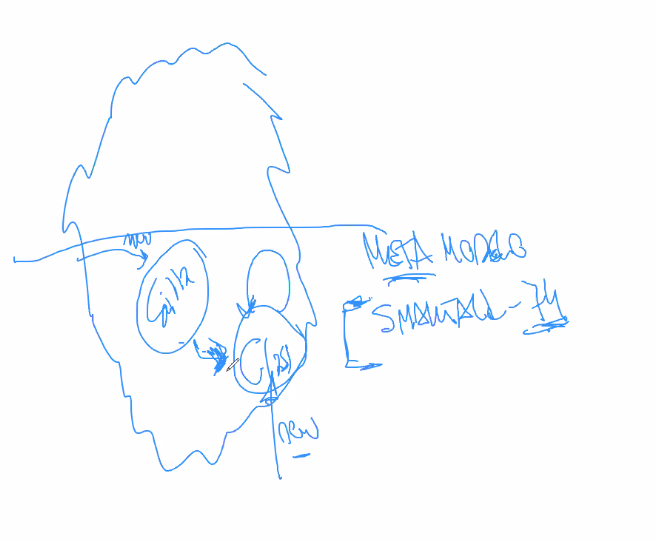
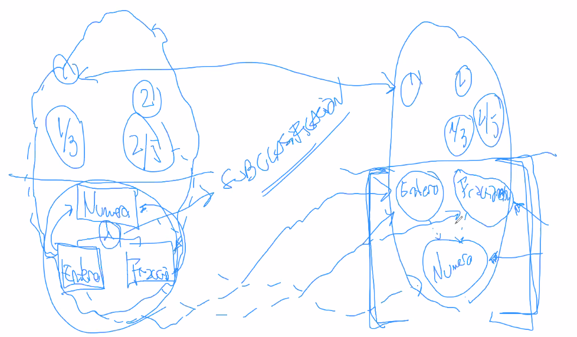
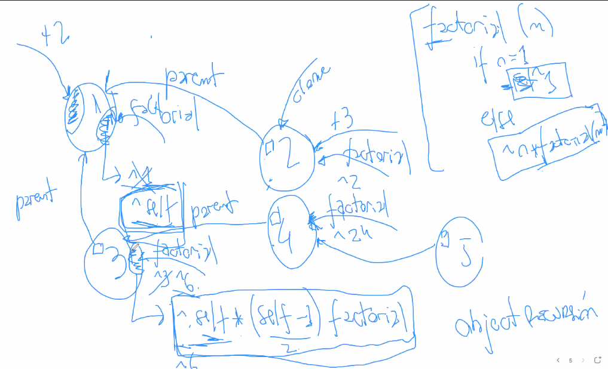

# Clase teorica 5

## Repaso

Hicimos el ejercicio de los semáforos, que parece una pavada pero es más
complicado de lo que parece.

- encapsular ciclos en mensajes para darle declaratividad
- algoritmo para sacar codigo repetido
  - lo mas importante es darnos cuenta de que nos falta una abstracción
  - hay momentos y momentos, si o si falta una abstracción cuando el código está
    estable.

Quedamos en que varios objetos saben responder el mismo conjunto de mensajes.

## Polimorfismo

**Polimorfismo** es una relacion entre un conjunto de objetos y un conjunto de
mensajes. Los objetos de un conjunto son *polimorficos* entre si respecto de un
conjunto de mensajes (protocolo, al nombre) si todos los objetos del primer
conjunto responden semánticamente igual los mensajes del 2do.

Semanticamente igual: a partir de lo que entiendo con el nombre del mensaje
hacen lo mismo. Es el mismo "que".

Es fundamental que los colaboradores del msj sea polimorfico entre si y la
respuesta del mensaje sea polimorfica entre si.

> Ejemplo: los enteros y los reales son polimorficos con respecto a `+`.

Si dos objetos A y B son polimorficos respecto de cierto protocolo, también lo
son de todos los subconjuntos de esos protocolos.

En un lenguaje dinámicamente tipado no hay una construcción linguística que
defina el conjunto de mensajes, puede ser aribrario. En los estáticamente
tipados tiene que existir una construcción linguistica.

**Protocolo**: Todos los conjuntos de mensajes que sabe responder. Tambien se
puede hablar del protocolo "all".

Motivación: que el *que* siga siendo el mismo mientras que el *como* cambia.

Cuando uno modela tiende a buscar objetos polimorficos para simplificar el
modelo. Permiten pensar en terminos de polimorfismo.

**Ventaja importante:** Reduce vocabulario y por lo tanto simplifica el modelo.

Ejemplo:

- En C, no puedo separar el que del como

  ```c
  void buscarEnArray(...)
  void buscarEnLista(...)
  ```

- En cambio en smalltalk tengo menos vocabulario

  ```smalltalk
  array buscar
  lista buscar
  ```

  Como tengo que usar menos palabras, me acuerdo de menos detalles y simplifica
  mi modelo.

### Idioma

- Ingles
  - Ventaja: Si escribo mi modelo en ingles, mantengo polimorfismo con el
    lenguaje de programación (el lenguaje de prog está escrito en ingles).

    Voy a poder tener objetos polimorficos con la std

  - Desventajas: Traducción. Generalmente el dominio del problema está escrito
    en castellano (a menos que estemos trabajando para afuera). Tengo que hacer
    un proceso de traducción del dominio en castellano a inglés.

    Pierdo el *lenguaje ubicuo* (mismo lenguaje en modelo que dominio)

- Castellano
  - Desventaja: Pierdo polimorfismo.
  - Ventaja: mantengo lenguaje ubicuo.

> Recomendación de hernan: programar todo en ingles.

## Clases vs prototipos

Como saco el código repetido a una nueva abstracción?

Se divide en dos por cuestiones filosoficas segun como el ser humano organiza el
conocimiento (hay mas y hay grises)

- Implementación clásica / aristotelica
- Moderna / Widggestein

### Implementación clásica / aristotelica (clases)

**Platón**: los entes de la realidad se dividen en dos.

- Los que representan elementos concretos (mi silla)
- Los conceptos o ideas (silla)
  - Entes no fisicos.

En el mundo del dominio,

- Lo concreto son objetos o instancia
- Los conceptos son clases

Clases: Existen para **representar conceptos o ideas** de mi dominio del
problema (no para no repetir código, etc.)



Las clases saben responder

- `new`, que crea una nueva instancia de ella. No es operador sintáctico, es
  un mensaje.

  > Por eso están los constructores, algo raro que tuvieron que hacer porque el
  > New no es un mensaje sino que es un operador sintáctico.
  >
  > Es cuestionable desde un punto de vista de modelado, pero se hace así por
  > una cuestión histórica (porque simula 67 lo hacía así). Entonces todas las
  > clases tienen la responsabilidad de instanciar. Tiene desventajas.

- `name`

- Los mensajes que sus instancias saben responder. En smalltalk se llaman
  *selectors*.

  Las clases definen el comportamiento de sus instancias. Antes el objeto
  buscaba en sus métodos, pero en este modelo lo buscan en la clase para que
  ejecute en el contexto de la instancia. Los objetos responden los mensajes a
  través de las clases.

Para que exista un objeto, tiene que existir su clase. No puedo tener objetos
que no sean instancias de ninguna clase (sino no sabría responder ningún
mensaje).

La manera en la que formamos abstracciones es viendo cosas repetidas. En este
paradigma es al revés, entonces es difícil elegir un buen nombre.

> Por eso cuando no se bien que nombre ponerle, ponerle un nombre sin
> significado, tener herramientas de refactoring (al menos rename), etc.

#### Meta modelo



Las clases también tienen que ser instancias de alguna clase, y tenemos una
regresión al infinito, en algún momento se tiene que frenar.

> Meta algo es lo que describe / define a algo. Las clases podrían llamarse meta
> instancias, son los objetos que definen como se comportan sus instancias. Por
> una custión histórica se los denomina clases (por simula 67)

Hago que todos los objetos sean instancia de la clase `class`, que es instancia
de si misma. Entonces cuando quiero crear una nueva clase, le mando un mensaje
`new` a `class`. (como hago que una clase sea instancia de si misma? huevo y la
gallina).

Este es el meta modelo de smalltalk 74 (nosotros usamos smalltalk 80). También
lo usan java, c#, etc.

Otra forma de resolver el problema es que las clases no sean objetos (pero deja
de ser consistente, te fuiste de la definición formal del paradigma). c++ hace
eso. Por eso ahi hay metodos estáticos (ahí nos vamos del paradigma, porque en
ellos no existe this, porque no estoy en una instancia).

Java hace que a nivel ejecución sean objetos, pero mantiene el metamodelo de
c++.

#### Object browser

Instance y class muestra cuales son los que sabe responder la instancia y cuales
sabe responder la clase.

#### Por qué aristoteles?

Aristóteles, discipulo de platón, dice que falta que el ser humano también
organiza sus ideas dentro de ontologías (jerarquías) de conceptos. Dentro de
conceptos hay conceptos abstractos.



Esa relación se denomina subclasificación (o herencia). Significa que todo
entero se comporta como número y toda fracción se comporta como número.

Un objeto no es lo que define la clase, sino que lo que define toda su
jerarquía.

> No es el objetivo principal de la subclasificacion la de reutilizar código. Es
> la peor manera de usarlo

Subclasificamos para organizar los conceptos del dominio del problema, **no**
para reutilizar código. Especializa un concepto (algo más generico como número a
algo más particular como Numero)

> "No subclasificamos para reutilizar código" por favor combatan eso en su vida
> personal - maxi.

#### Clases abstractas

`self subclassResponsability` para hacer un metodo abstracto. Una clase es
abstrata cuando tiene mensajes definidos de manera abstracta.

Una abstracta *pura* es una tal que todos los mensajes son abstractos.

> si una clase representa un concepto, que representa una interfaz?

> por que se implemento herencia multiple en c++? Porque lo estaban pinchando de
> que no lo podia hacer de manera eficiente el c++, y lo hizo.

### Moderna / Widggestein

Otra manera de organizar el conocimiento, prototipica

Acá se relacionan objetos en vez de relacionar clases.

Esto es lo que veniamos usando hasta el momento. Denotative objects es una
implementación de eso. Para crear un objeto nuevo, uso la clonación.

#### Object recursion



Recursion a nivel objetos. Estamos acostumbrados a recursion a nivel funciones

```python
factorial(n):
  if n == 1
    # base
    return 1
  
  # recursivo
  return n * factorial(n-1)
```

En objetos la base esta implementada como un objeto, y el cuerpo recursivo otro.
Y no tenemos ifs, simplemente delegamos a objetos distintos

#### V y d

- Ventaja: son todos objetos, no necesito clases. Son mas simples a nivel
  implementación.

  Si tengo ganas de representar qué es un Entero, es un objeto más. Y no hay
  ninguna relación de cambio de meta nivel.

- Permiten modelar objetos únicos y particulares sin más

Primer lenguaje de prototipado fue **self**, un lenguaje muy interesante.

> hernan recomienda bajarlo y usarlo. Es muy interesante el UI, porque solo hay
> objetos. Te rompe la cabeza. https://selflanguage.org/

Hay que buscar el limite en cuando la simplicidad hace que sea más difícil de
usar el lenguaje.

Otro muy famoso es javascript

> Al que le interese puede ver como implementaron denotative objects en cuis.