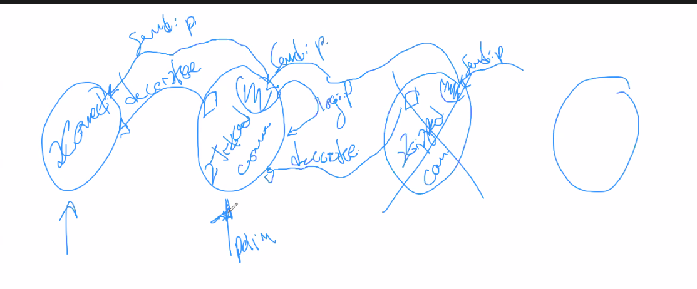

# Clase teórica #9

> Buscar "programming katas"

## TDDGuru

World > Open > TDD Guru.

- W: Writing a test
- R: Rojo modo red, falla un test
- N: Not doing TDD
- G: green, todos los tests pasando
- R azul: Refactoring

## Patrones de diseño

Arrancan con Kent beck y ward cunningham. Ward se inspira de christopher
alexander en un libro de patrones de arquitectura de construcción.

## Design patterns

Design patterns: el famoso libro de patrones. El libro pasa a ser el mas vendido
en un año, sobrepasando a los libros de Knuth. Recomienda comprarlo hernan.

> Conferencias PLoP (Pattern languages of programs)

Estan divididos en

- **Name**: Lo mas importante, sintetiza lo que hace.
- **Intent**: Lo segundo mas importante.
- **Description**
- **Structure**: Lo menos importante.
- **Implementation**
- **Known uses**: Lo tercero mas importante. Para no aceptar cualquier cosa como
  patrón. Por lo general acá hay un framework, MVC (Model View Controller). Fué
  el primer fwk de objetos.

  - Modelo: Lo que generalmente trabajamos nosotros
  - Visual: como muestro un modelo
  - Controller: relacionar el input del usuario con el modelo y la vista.

  Fue bastardeado por los frameworks web, pero no son exactamente lo mismo que
  el mvc original de smalltalk 80.

- **Related patterns**

de esta forma se documentan. Tiene una estructura como academica.

Kent beck hace su propio libro, "smalltalk best practices patterns". Otro libro
recomendado por Hernan.

La mayoria reemplazan subclasificación por composición. Generalmente, los
patrones de diseño se enseñan a través de la estructura.

> Esto es un proxy, y te dan el diagrama de clases. Pero el problema es que es
> parecida strategy, adapter, y después te confundís. Por es lo mas importante
> es la intención, porque es lo que define *que* hace un patrón

Los patrones **no se inventan**, se descubren. Son el resultado de aplicar
exitosamente la misma solucion a un problema recurrente.

Problema: se empiezan a meter patrones de diseño cuando no eran necesarios. Se
sobrediseña, generando diseños mas complejos de mantener.

Si a tu diseño lo cambias constantemente como en TDD va a ser más propenso al
cambio, que a un diseño que hacés supuestamente para poder cambiar como en
patrones (que uno hace con futurología).

El patrón lo tenemos que olvidar, si vamos a modelar correctamente la realidad
el patrón va a desaparecer. Si uno trata de aplicarlos de entrada, termina con
un diseño mas complejo

Y para que sirven? Qué tienen de bueno? Incrementan nuestro vocabulario para
poder comunicarnos a nivel diseño. Nuevas palabras que nos permiten expresarnos
mas facilmente. **Para comunicarnos** y nunca usarlos para resolver un problema.

Cuando generamos nuevas abstracciones nos ponemos contentos (y eso pasó con los
patrones.)

### Singleton

Por qué es malo? Es como pablo escobar, el patrón del mal.

Un singleton es un patrón en el cuál tenes una única instancia de una clase. El
problema no es el patrón, sino que se usa mal. El mayor problema porque java no
tiene contexto global, y se lo usa a veces para tener acceso global a ciertos
objetos. El problema es el mismo de las vars globales, generas acoplamiento
fuerte entre el usuario del singleton y el singleton, que es imposible de romper
y se complica testear, modificar el acceso a ciertos objetos, etc.

El error más común es que un objeto abajo de todo del árbol de ejecución accede
a tu base de datos con tipo `Database.getSession()...` mediante un singleton

> design patterns head first tiene un contenido muy mediocre, no lo veamos.

### Tipos de soluciones

A problemas recurrentes

| Tipo            | Language specific | Abstract / Concrete | Dominio de problema particular |
| --------------- | ----------------- | ------------------- | ------------------------------ |
| Idioms          | Si                | Concrete            | No                             |
| Design patterns | No                | Abstract            | No                             |
| Frameworks      | Si                | Concrete            | Si                             |

- **Idioms**: soluciones especificas a un lenguaje, por ej. de smalltalk no son
  los mismos que java o ruby. Concretos: hay codigo relacionado, no es un
  diagrama de clases.

  Ejemplo:

  ```smalltalk

  stream := FileStream on: 'pepe.txt'
  stream nextPutAll: 'asdfasd'
  ...
  ```

  En realidad lo hacemos

  ```
  [

  ] ensure: [ stream close ].
  ```

  Es equivalente a un finally.

  Esto se puede abstraer a un `open: during:`. Es un idiom en smalltalk.

  En la actualidad la palabra idiom no se usa tanto porque es muy común poder
  parametrizar código por medio de closures

- **Design patterns**

  Abstractos: no me puedo bajar un composite de internet, lo tengo que
  implementar de manera particular y contextual. Idem proxy.

- **Frameworks**: Soluciones a problemas recurrentes que son específicos de un
  lenguaje de programación, concretos (me puedo bajar uno, ej. ruby on rails,
  hibernate, laravel)

  - Hibernate: ORM (object relational mapper), fwk para mapear objetos a bases
    relacionales. Este es el dominio del problema que ataca. Doctrine, elocuent
    en php.

  - Otros fwk atacan el problema de hacer una aplicación web. Sesion, generar
    html, componentización, etc. Spring en java, Ruby on rails, laravel

  Para que un fwk se denomine fwk tiene que existir la **inversión de
  control**. Es fácil confundir un fwk con una librería de clases. Qué
  significa? El fwk envía mensajes a tus objetos para que hagan las cosas, y no
  al revés. **Si no hay IoC no es un framework.**

  > Tipico ejemplo web, el fwk toma un request http, lo manosea y se lo delega a
  > un controller.

  Morph en cuis es el fwk visual, redirecciona los eventos a los morph que uno
  desarrolla.

  En su mayoría son para problemas computables. No hay frameworks bancarios.

### Decorator

Las combinaciones hacen una explosión de clases.

Subclasificando por motivos accidentales a qué es una conexión. No importa si es
encriptado, zippeado, trazeado, etc. Usar subclasificación para eso es erróneo.

Se resuelve por medio del patrón decorator, agregar funcionalidad (ortogonal
[agregado por wilki ]) dinámicamente a un objeto.

> "Es una opción a la subclasificación" - libro. Hernan: no, es una o la otra,
> aplicamos decorator justamente porque está mal.

Ortogonal: no pertenece al mismo dominio de problema de lo que estoy queriendo
solucionar.

Son básicamente wrappers. Voy agregando decorators



Cada instancia conoce al objeto que decora, y a partir de eso agrega
funcionalidad que necesita. Jerarquía del tipo de patrones

```text
Connection
  ConnectionDecorator
    EncryptedDecorator
    TracedConnection
    ZippedConnection
  TCPConnection
```

ConnectionDecorator tiene un `decoratee` (una conexión, a lo que decora) y cada
uno sobreescribe las cosas y se los tira a lo que decora. Para usarlo,

```text
ZippedConnection decorating: (TracedConnection decorating: connection)
```

Observaciones:

- No es necesario tener una superclase común a todos los decoradores.
- Estáticamente vs dinámicamente tipado
  - La jerarquía es necesaria en un lenguaje estáticamente tipado, o con una
    interfaz.
  - En uno dinámicamente tipado solo hace falta que respondan los mismos
    mensajes. No hace falta subclasificar nada.
  
  - Los lenguajes dinámicamente tipados generan soluciones menos acopladas

  - Limitación en lenguajes de clasificación

    - **forwardear**: mandar el mismo mensaje a otro objeto, se pierde quien es
      el self.

    - Cuando **delego** un mensaje, envio el mismo mensaje a otro objeto pero el
      self sigue siendo el mismo.

    La subclasificación es una implementación de prototipos pero solo para
    clases. Prototipación es una implementación más genérica a nivel objetos.

    Es por eso que en js implementar clases es muy fácil. Delegación a nivel
    objetos podés implementar delegación a nivel clases.

- En un lenguaje de prototipación sería como definirle el parent. El decorator
  no existe, es directamente lo que hacemos con un lenguaje de prototipación. El
  decoratee es el parent.

> Parecido a los task wrappers de los channels

Comentarios:

- El orden de mi lista de decoración es importante

  > No es lo mismo encriptar algo zipeado que zipear algo encriptado

  Cuando importa el orden, se suele usar el patrón **builder**

Que pasa si ya tengo un objeto que lo referencia, y quiero arrancar a decorarlo?
El decorator agrega funcionalidad dinamica siempre y cuando no haya mas
referencias a la que quiero decorar. Deberia cambiar todas las referencias.

> Smalltalk tiene un mensaje `self become` que swappea referencias entre
> objetos.

## Patrón builder

Me permite construir relaciones complejas entre objetos de forma fácil.

Pregunta: por que mejor esto que un metodo o funcion?
