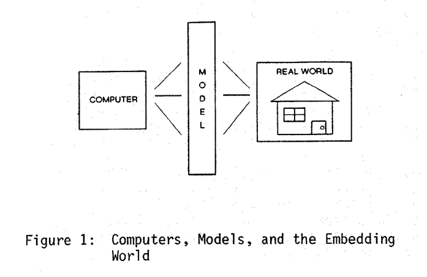

# Discusión de papers #1

Papers:

- Programming as theory building (principal) ([link](https://www.dropbox.com/s/e2k1fuwlgehrk9a/Programming%20as%20Theory%20Building-1.doc?dl=0))
- Revisigint Naur's Programming as Theory Building for Enterprise Architecture
  Modelling ([link](http://e-centre.mdx.ac.uk/staffpages/tonyclark/Papers/CAISE-Final-v3-Barn-Clark.pdf))
- The Limits of Correctness ([link](https://student.cs.uwaterloo.ca/~cs492/11public_html/p18-smith.pdf))
- A Philosophical Re-Appraisal of Peter Naur's Notion of "programming as Theory
  Building"
  ([link](https://aisel.aisnet.org/cgi/viewcontent.cgi?article=1017&context=ecis2007))
  
## Programming as theory building (1985)

El paper quiere presentar la Theory Building View de la programación

- Muestra case studies (compilador y real time sytems) que muestran que con
  programas grandes, adaptarlos y corregir errores depende de cierto
  conocimiento que poseen los que lo armaron originalmente.

- Presenta **Ryle's notion of theory**, una definición de teoría que se usa para
  definir la diferencia entre actividades intelectuales y simpĺemente
  inteligentes.

- La teoría que debe ser construida por un programador entonces es la que indica
  como ciertas cosas del mundo van a ser manejadas por programas.

  Por qué el conocimiento de la teoria del programador trasciende el
  documentado?

- La teoría de un programa no puede ser expresado, está inextricablemente ligado
  a los seres humanos.

  >> Es raro que diga que no se puede expresar

> In preference to program revival, the Theory Building View suggests, the
> existing program text should be discarded and the new–formed programmer team
> should be given the opportunity to solve the given problem afresh. Such a
> procedure is more likely to produce a viable program than program revival, and
> at no higher, and possibly lower, cost

>> No estoy de acuerdo con eso. Los bugs que se fueron solucionando con el tiempo
>> se ven capturados en el código legacy. Con un complete rewrite, si bien formás
>> nueva teoría y los programadores están familiarizados con la codebase, se debe
>> considerar el costo adicional de arreglar todos los casos borde y bugs que
>> habían en el codebase viejo.

## Revisiting Naur’s Programming as Theory Building for Enterprise Architecture Modelling

Le da otra chance a la vista de programacion como theory building a ver si sirve
para modelar Enterprise Architectures (EAs).

## The limits of correctness (1985)

Qué es un modelo y sus límites.

Se puede probar la correctitud de todos los programas para dormir tranquilo de
noche y garantizar que no se va a romper nada? **No**. Hay limitaciones
inherentes de que se puede probar de computadoras y programas de computadoras.

> Just because a program is "proven correct", you cannot be sure that it will do
> what you intend.

Todo modelo lidia con lo que soluciona en **cierto nivel de abstracción**,
prestando atención a algunas cosas e ignorando otras, juntando cosas parecidas
en categorías, etc.

Los modelos son **inherentemente parciales**, no se puede capturar absolutamente
todos los detalles de lo que se está modelando.

Si bien los modelos son abstractos, las *acciones* no lo son. Hacer una acción
en el mundo real inevitablemente sale del modelo.

No hay *garantía* de que el modelo sea correcto. No se tienen garantías de nada
de la relación entre el modelo y el mundo real.

La *teoría de modelos* matemática y lógica se centra en la relación de la
izquierda, de las representaciones, descripciones y programas del modelo hacia
el modelo, pero no a la de la derecha.

> What about the relationship on the right? The answer, and one of the main
> points I hope you will take away from this discussion', is that, at this point
> in intellectual history, we' have no theory of this right-hand side relation-
> ship.
>
>> Pregunta: Como cambió esto desde el 85? Es mejor ahora?

Para demostrar correctitud, uno tiene que armar dos cosas

- Una especificacion: dice *qué* es el comportamiento correcto. Son
  *decalrativas*
- Una implementación (o programa): dice *como* hacerlo. Son *procedurales*

  > Siguen siendo procedurales hoy en día?

Una demostración de correctitud entonces dice que todo sistema que corra el
programa va a satisfacer la especificación.

- Solo dice que dos caracterizaciones formales de algo son compatibles entre sí,
  pero no en relación al mundo real

## A Philosophical Re-Appraisal of Peter Naur's Notion of "programming as Theory Building" (2007)

No lo lei :)
