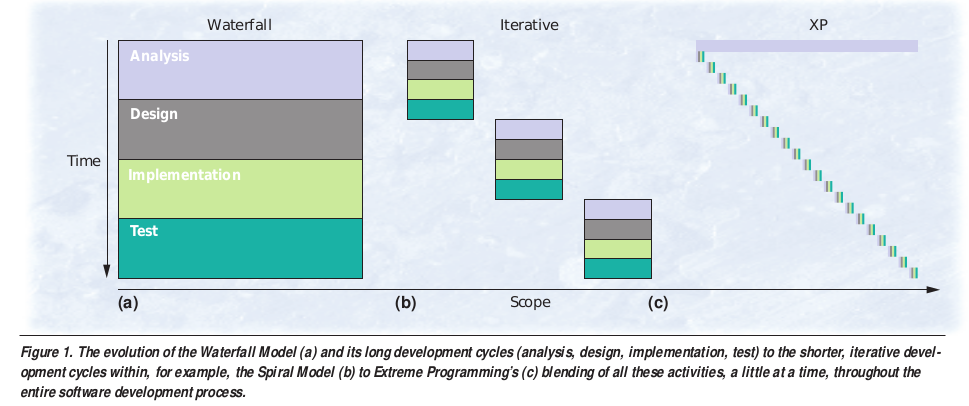
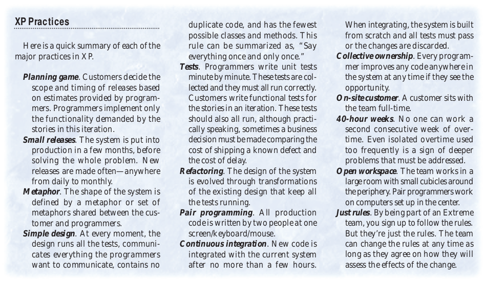
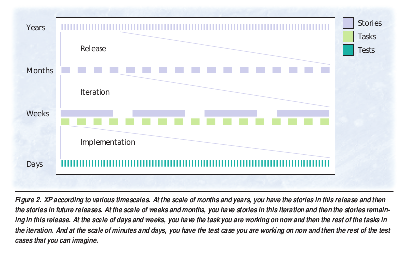

# Discusión de papers #3 - No Silver Bullet

Papers:

- No silver bullet (Brooks) ([link](http://worrydream.com/refs/Brooks-NoSilverBullet.pdf))
- Embracing change with extreme programming ([link](https://www.dropbox.com/s/bkb7y06kvwnzd9a/Extreme%20programming.pdf?dl=0))
- The Mythical Man-Month ([link](https://www.cs.drexel.edu/~yfcai/CS451/RequiredReadings/MythicalManMonth.pdf))

## No silver bullet

Address the essential parts of the software task, fashioning abstract conceptual
structures of great complexity. Sugiere:

- Explotar el mercado para evitar construir lo que se puede comprar

  > No estoy tan de acuerdo, a veces comprar algo hecho termina siendo más
  > problema que armarlo directamente. Por ej. los bancos que llevan esto a un
  > extremo y por muchos años no tuvieron equipos de tecnología, pura
  > burocracia.

- Usar prototipado rápido para una iteración planificada que permita establecer
  los requerimientos.

- Hacer crecer al software orgánicamente, agregando más funcionalidades a medida
  que se corren, usan y testean.

- Identificar y desarrollar los grandes desarrolladores conceptuales de las
  generaciones que vienen.

Comparación software con hardware

- No es que el desarrollo del soft es lento, el del hw es muy rápido

El software tiene dos nociones de dificultades: esencial y accidental

- Esencial: Las dificultades inherentes en la naturaleza del software

  La esencia es una construcción de diferentes conceptos: datos, algoritmos,
  invocacuón de funciones.

  Propiedades inherentes de la esencia irreducible del software moderno:

  - Complejidad
  - Confirmidad

    > But in all cases, much complexity comes from conformation to other
    interfaces; this cannot be simplified out by any redesign of the software
    alone.

  - Cambiabilidad

    > In short, the software product is embedded in a cultural matrix of
    applications, users, laws, and machine vehicles. These all change
    continually, and their changes inexorably force change upon the software
    product.

  - Invisibilidad

- Accidental: Dificultades que hoy en dia atendemos en prod pero que no son
  inherentes.

### Past breakthroughs

Tres pasos que fueron fructíferos, pero solo en atacar lo accidental y no lo
esencial.

- **Lenguajes de alto nivel**

  > Moreover, at some point the elaboration of a high-level language becomes a
  burden that increases, not reduces, the intellectual task of the user who
  rarely uses the esoteric constructs.

- **Time sharing**
- **Unified programming environments**

### Hopes for the silver bullet

- **Ada**: es otro lenguaje de alto nivel
- **POO**

  > For both abstract types and hierarchical types, the result is to remove a
  higher-order sort of accidental difficulty and allow a higher-order expression
  of design. Nevertheless, such advances can do no more than to remove all the
  accidental difficulties from the expression of the design. The complexity of
  the design itself is essential; and such attacks make no change whatever in
  that.

- **Artificial intelligence**

  Qué pasa con cosas como github copilot ahora?

- **Expert systems**
- **Automatic programming**
- **Graphical programming**: software is very difficult to visualize, no sirve.
- **Program verification**. Parecido a lo que dicen en los papers de
  [programming as theory building](1_programming_as_theory_building.md), la
  verificación solo sirve para ver que está bien programado el modelo, pero no
  verifica que el modelo represente bien al dominio.

   > even perfect program verification can only establish that a program meets
  its specification. The hardest part of the software task is arriving at a
  complete and consistent specification, and much of the essence of building a
  program is in fact the debugging of the specification.

- **Environments and tools**
- **Workstations**

### Promising attacks on the conceptual essence

- Buy versus build

  > The most radical possible solution for constructing software is not to
  construct it at all.
  > The key issue, of course, is applicability.

- Requirements
- Incremental development: Hacer crecer un sistema de forma top-down.
- Great designers

  > Whereas the difference between poor conceptual designs and good ones may lie
  in the soundness of design method, the difference between good designs and
  great ones surely does not. Great designs come from great designers. Software
  construction is a creative process. Sound methodology can empower and liberate
  the creative mind; it cannot enflame or inspire the drudge.

## Extreme programming - Kent Beck

Comparaciones entre diferentes metodologías

la linea azul del principio en XP es porque necesitas saber que vas a programar
antes de ponerte a implementarlo.

Prácticas de extreme programming

Timescales

> n XP, however, two twists on conventional testing strategies make tests far
more effective: Programmers write their own tests and they write these tests
before they code.

TDD y sentido común?

Problemas:

- Underestimation
- Uncooperative customers
- Turnover
- Changing requirements

También da varios testaments de equipos a los cuales les funcionó XP. Me parece
curioso que incentive tanto el pair programming, no se si siempre sirve.