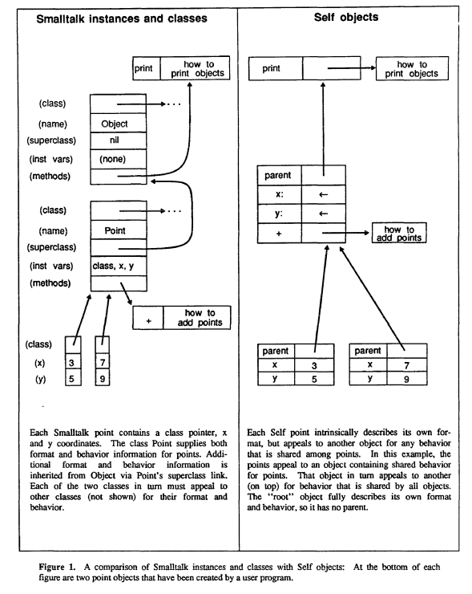

# Discusión de papers #4 - Self

Papers:

- Self: The Power of Simplicity ([link](https://www.dropbox.com/s/nqp124hflmtoq0c/SELF-The%20Power%20of%20Simplicity.pdf?dl=0))
- Classes vs. Prototypes - Some Philosophical and Historical Observations ([link](https://ubadao.files.wordpress.com/2013/07/classes-vs-prototypes-some-philosophical-and-historical-observations.pdf))

## Self - The power of simplicity (1987)

- POO con **prototipos**, **slots** y **behavior**
- Nueva perspectiva de objetos y message passing
- A diferencia de smalltalk, no tiene variables. Obtiene información de estado
  mandando mensajes a `self` (de ahí sale el nombre)

Principios de diseño:

- **Messages at the bottom**: Message passing como la operación fundamental. No
  hay variables, solo *slots* que contienen objetos que se retornan a si mismo.

- **Occam's razor**

  > The principle of parsimony or law of parsimony is the problem-solving
  > principle that "entities should not be multiplied beyond necessity"
  > sometimes inaccurately paraphrased as "the simplest explanation is usually
  > the best one."
  > https://en.wikipedia.org/wiki/Occam%27s_razor

  - No hay clases ni variables, su rol lo puede ocupar cualquier objeto
  - No hay distinción entre acceder a una variable y mandar un mensaje
  - Los objetos, procedures y closures son iguales representando a closures y
    procedures como *prototipos* de activation records. 

- **Concreteness**: Una metáfora cuyos elementos son tan concretos como es
  posible.

  En un lenguaje basado en clases, un objeto se crea *instanciando* un *plan* en
  su clase. En uno basado en prototipos, un objeto se crea *copiando* un
  prototipo. En self cualquier objeto puede ser clonado.

En self, los objetos contienen *slots* con nombres que pueden contener estado o
comportamiento. Si un objeto recibe un mensaje y no tiene matching slot,
continúa via el puntero a su padre. Así es como implementa herencia.

### Comparación entre prototipos y clases

- Relaciones más simples
- Examples of preexisting modules
- Support for one of a kind objects

  Por ej. si queremos tener un solo objeto para `true` y `false`, es más fácil
  con self. En smalltalk si o si tiene que haber una clase para cada uno.

- Elimination of meta-regress

Con herencia la tendencia natural es hacer que el prototipo el mismo objeto que
tiene el comportamiento de ese tipo de objetos. Pero esos sistemas tienen que
proveer dos maneras de construir objetos

- Hacer familiares del prototipo
- Copiar un objeto que no es un prototipo

El resultado es que los prototipos se hacen especiales y no son prototipicos.
Self evita esto combinando prototipos y herencia

> no entiendo bien cual es el problema

La solución es poner el shared behaviour en un objeto que sea padre de *todos*,
hasta el prototipo. Tiene un rol similar a una clase, solo que no contiene
información de formato.

### Closures

En self se usan slots y herencia para armar closures y procedimientos

- Variables locales. Los slots cumplen este propósito.
- Environment link

  [Lexical scoping](https://stackoverflow.com/questions/1047454/what-is-lexical-scope)

- Parents viewed as shared parts

> An **activation record** (AR) is a private block of memory associated with an
> invocation of a procedure. It is a runtime structure used to manage a
> procedure call. An AR is used to map a set of arguments, or parameters, from
> the caller's name space to the callee's name space

### WIP

- Multiple inheritance
- Private slots (encapsulation)
- Activation details

### Conclusiones

Self ofrece un nuevo paradigma para POO. No son necesarias las clases y
variables. Eliminarlos

- Elimina metaclass regress
- Saca la distincion entre instanciación y subclasificación
- Permite borrar las diferencias entre objetos, procedimientos y closures.

Reducir el numero de conceptos en un lenguaje lo puede hacer más fácil de
explicar, entender y usar. Pero "As the variety of constructs decreases, so
does the variety of linguistic clues to a system’s structure"

Puede expresar idioms de lenguajes OO tradicionales como clases e instancias,
pero también puede ir más allá y representar

- One of a kind objects
- Active values
- Inline objects y clases
- Overriding instance variables

### Mis dudas y reflexiones

- Smalltalk no tiene prototipos también? Qué estuvimos haciendo?
- Por qué está mal hacer que el prototipo defina comportamiento?

## Classes vs. Prototypes (1996)

- En prototipos no hay clases. Nuevos objetos se crean mas directamente
  componiendo objetos concretos, usualmente referidos como *prototipos*.

- Los lenguajes basados en prototipos son conceptualmente más simples. Son
  suitable para el desarrollo de sistemas que evolucionan y son exploratorios y
  distribuidos.

La distinción refleja una disputa filosofica sobre como representar
abstracciones. Plato veia *formas*, estables, abstractas, descripciones ideales
de las cosas, como poseedoras de una existencia mucho mas real que sus
instancias en el mundo real.

- Los lenguajes basados en clases son platonicos en su uso explicito de clases
  (como smalltalk, cpp, simula) para representar similaridad entre colecciones
  de objetos.

- Los lenguaje basados en prototipos (Self, Omega, Kevo, GlyphicScript,
  NewtonScript) representan otra vista del mundo, en el que uno no depende de
  categorizaciones y clasificaciones, sino que intenta de hacer que los
  conceptos del dominio del problema sean tan tangibles e intuitivos como sea
  posible.

  Argumento a favor: La gente suele ser mejor lidiando con cosas concretas y
  luego generalizandolas que absorbiendo principios abstractos y generales para
  luego aplicarlos a casos particulares.

**Este paper** hace comparaciones no técnicas, sino que ve las diferencias entre
class y prototype desde un punto de vista filosófico.