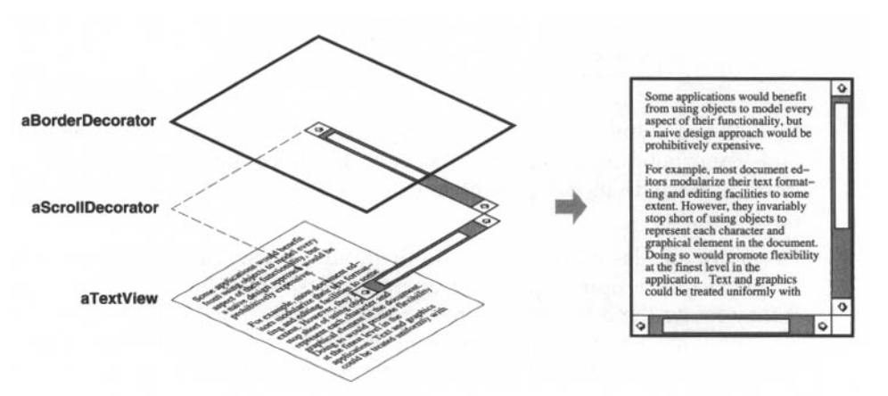
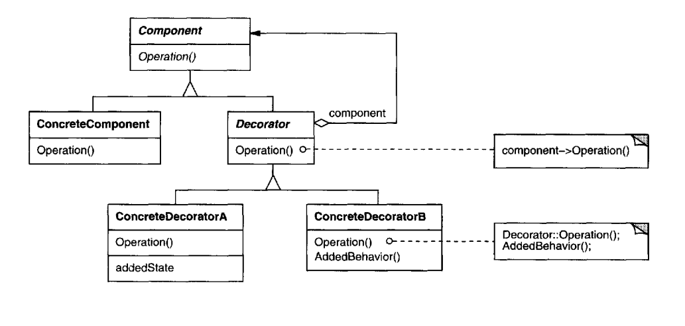
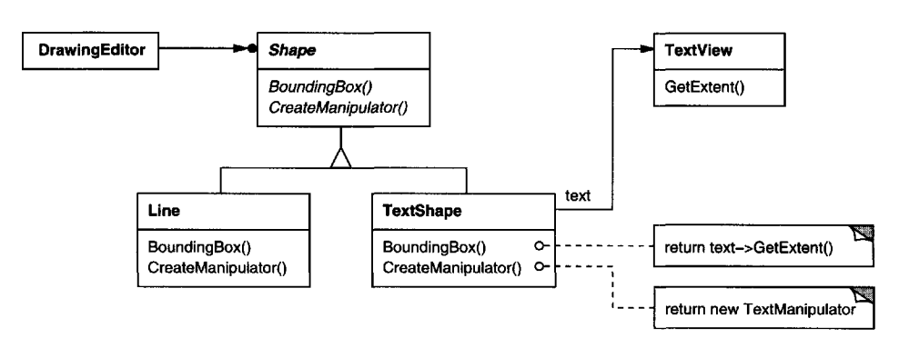
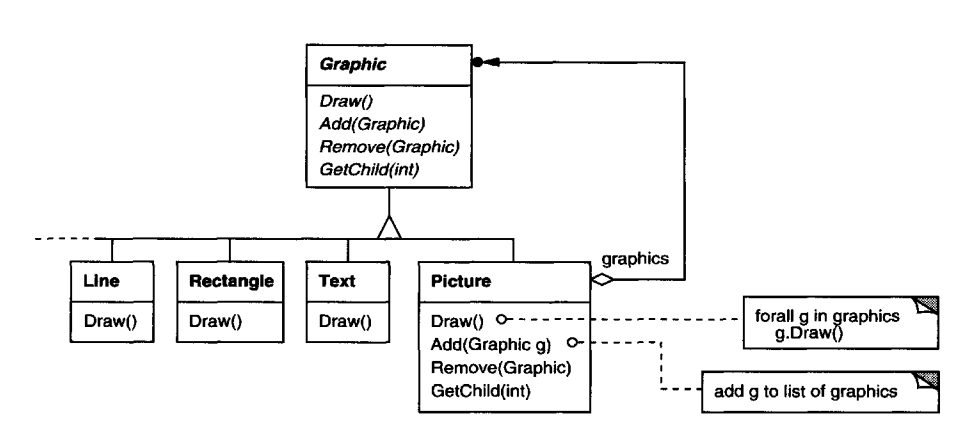

# Patrones

Del Design Patterns

## Null object

## Method object

## State pattern

> Discutido 4/08/21

> State (305) Allow an object to alter its behavior when its internal state
> changes. The object will appear to change its class.

Qué pasa cuando tenemos un objeto cuyo comportamiento depende de un estado
interno? Podemos tener ifs dentro de cada operación, pero vamos a tener
condicionales repetidos que complican el mantenimiento.

Ejemplo: `TCPConnection`, dependiendo del estado como se comportan las
operaciones. Hay una clase para cada subestado, TCPConnection delega a ella y
esta se encarga de hacer lo que tenga que hacer y cambiar de estado.

Consecuencias

- Localiza el comportamiento específico a cada estado y lo particiona para
  diferentes estados.
- Hace que las transiciones de estado sean explícitas, ya que se cambia de
  objeto. Sino, si el estado es algo que se computa en base a variables las
  transiciones son asignaciones.

  También evitan que el context tenga estados internos inconsistentes, porque
  las transiciones de estado son atómicas desde el punto de vista el context.
  Cambian una sola variable.

- Los state objects se pueden compartir.

Para discutir en clase:

- The Flyweight (195) pattern explains when and how State objects can be shared
- State objects are often Singletons (127).

  Si singleton es malo, no es costoso estar creando todo el tiempo objetos
  nuevos? Cómo se suele hacer?

Discusión en clase:

Hernan: lo que conviene es que el contexto cambie el estado, poorque sino los
estados estan acoplados y rompes el encapsulamiento del contexto. Hay pocas
situaciones en donde es muy complejo y tal vez conviene que lo haga el estado.

La solución 1a de stack se hace con este patrón.

## Decorator - Adapter - Proxy

> Discutidos 7/08/21

### Decorator

> Decorator (175) Attach additional responsibilities to an object dynamically.
Decorators provide a flexible alternative to subclassing for extending
functionality.

a.k.a: wrapper

- Intent: Agrega funcionalidades adicionales a un objeto de forma dinámica.
  Proveen una alternativa flexible a subclassing para extender la funcionalidad.

- Motivation: A veces queremos agregar responsabilidades a objetos y no clases
  enteras.

  

- Aplicability
  - Agregar responsabilidades a objetos individuales dinamica y
    transparentemente, sin afectar a otros objetos.
  - Cuando extender con subclasificación no es practico. Un número grande de
    extensiones independientes pueden generar una explosión de subclases para
    soportra cada combinación, o una definición de clase puede ser escondida o
    no existir para subclasificar.

- Structure

  

- Consecuences

  1. Mas flexible que herencia estática

      La herencia estática requiere hacer una subclase para cada combinación de
      responsabilidades (por ej. BorderedScrollableTextView, BorderedTextView,
      etc.), que hace que haya muchas subclases y más complejidad en un sistema.
      Proveer diferentes decorators te permite hacer mix n match de
      responsabilidades.

      También permite agregar una propiedad dos veces.

  2. Evita clases con muchos features arriba en la jerarquía. En vez de
     implementar todo de una en una clase compleja y configurable, implementas
     poquito y después lo extendés con decorators.
  
  3. Un decorator y sus componentes no son identicos. (no podemos rely on object
     identity)
    
  4. Muchos objetos chiquitos

> Strategy (315): A decorator lets you change the skin of an object; a strategy
lets you change the guts. These are two alternative ways of changing an object.

### Adapter

> Adapter (139) Convert the interface of a class into another interface clients
expect. Adapter lets classes work together that couldn't otherwise because of
incompat- ible interfaces.

a.k.a wrapper

- **Intent**: Convertir la interfaz de una clase en otra interfaz que esperan los
  clientes. Permite que clases con interfaces incompatibles colaboren entre si.

- **Motivation**

  Dos tipos: Class y object. Por ejemplo si tenemos un `TextView` (parte de un
  toolkit de UI) y queremos impelmentar un `TextShape` en un editor visual, y
  queremos usar `TextView` pero las interfaces no son compatibles.

  1. Heredamos la interfaz de shape y la implementación de text view (class)
  2. Componemos un text view dentro de un text shape e implementamos shape en
     terminos de la interfaz de TextView. (object).

     
  
  TextShape es el **adapter**

- **Aplicability**

  - Queremos usar una clase existente y la interfaz no matchea la que
    necesitamos.
  - Queremos crear una clase reutilizable que coopera con otras que no tienen
    nada que ver (o no se pueden preveer) que no necesariamente tienen
    interfaces compatibles.

### Proxy

> Proxy (207) Provide a surrogate or placeholder for another object to control
access to it.

(surrogate = sustituto)

## Composite

(object structural)

- Intent: Componer objetos en estructuras de árbol para representar jerarquías
  *part-whole* (que es esto?). Permite que los clientes traten a objetos
  individuales y composiciones de objetos de forma uniforme.

- Motivation: Graphical software que tiene primitivas (lineas, rectangulos
  ,texto) y cosas que se componen de primitivas y otras cosas, como Picture.

  

  > Duda: no es raro tener GetChild y que las primitivas respondan eso?

  La solución es tener una superclase que todos (los compuestos y los
  primitivos) formen parte. De esa forma se pueden componer recursivamente.

  > Duda: dice que puede proveer comportamiento por default pero va en contra de
  > lo que hablamos siempre que las clases abstractas tienen que ser 100%
  > abstractas.

## Visitor

(behavioral)

- Intent: Representar una operación que se va a ejecutar en los elementos de una
  estructura de objetos. Permite definir nuevas operaciones sin cambiar las
  clases de los elementos sobre los cuales opera.

- Motivation

  Por ej si tenes un compilador que produce un AST. Sobre el AST queres hacer
  pretty printing, type checks, generar codigo, etc. pero queda el código
  dificil de leer.

  Se pueden encapuslar las operaciones en un objeto **visitor**. Cuando un
  elemento *acepta* al visitor, le manda un request que encodea la clase. Luego
  el visitor hace una operación en ese elemento.

- Applicability

  - Una estructura de objetos contiene muchas clases de objetos con diferentes
    interfaces, y queres hacer operaciones que dependen de sus clases

    > (es como un switch recursivo estructural?)
  
  - Muchas operaciones que no tienen nada que ver entre si se tienen que
    realizar en objetos de una estructura, y querés evitar ensuciarlas con estas
    operaciones.
  
  - No cambia la estructura de los objetos pero si queremos agregar operaciones
    seguido. Esto es porque si cambia la estructura, tenemos que refactorizar
    las interfaces de todos los visitors.

- Consecuencias

  - Agregar nuevas operaciones es facil
  - Se juntan operaciones que tienen que ver y se separan las que no
  - Agregar nuevos elementos concretos es complicado
  
  > So the key consideration in applying the Visitor pattern is whether you are
  mostly likely to change the algorithm applied over an object structure or the
  classes of objects that make up the structure. The Visitor class hierarchy can
  be difficult to maintain when new ConcreteElement classes are added
  frequently. In such cases, it's probably easier just to define operations on
  the classes that make up the structure. If the Element class hierarchy is
  stable, but you are continually adding operations or changing algorithms, then
  the Visitor pattern will help you manage the changes.

  - Es como una generalización de un iterador para estructuras más complejas.

  - Puede romper encapsulamiento

    > Visitor's approach assumes that the ConcreteElement interface is powerful
    enough to let visitors do their job. As a result, the pattern often forces
    you to provide public operations that access an element's internal state,
    which may compromise its encapsulation.

## Observer

(Behavioural)

- Intent: Definir una dependencia uno a muchos entre objetos de forma tal que
  cuando uno cambia de estado, todos los que *dependen* de el se actualicen
  automáticamente.
  
- A.k.a: dependents / publish-subscribe
- Motivation

  Por ej. si hay una planilla en donde hay muchos gráficos, cuando actualizas
  los datos los gráficos se actualizan automáticamente.

  Hay dos partes: subject y observer. Todos los observers son notificados cuando
  hay un cambio en el subject, y ellos se sincronizan con el subject.

  Tambien se llama **publish-subscribe**. El subject publica notificaciones, y
  las envia sin tener que saber quienes son los observadores. Cualqueir número
  de observadores se puede suscribir para recibir notificaciones.